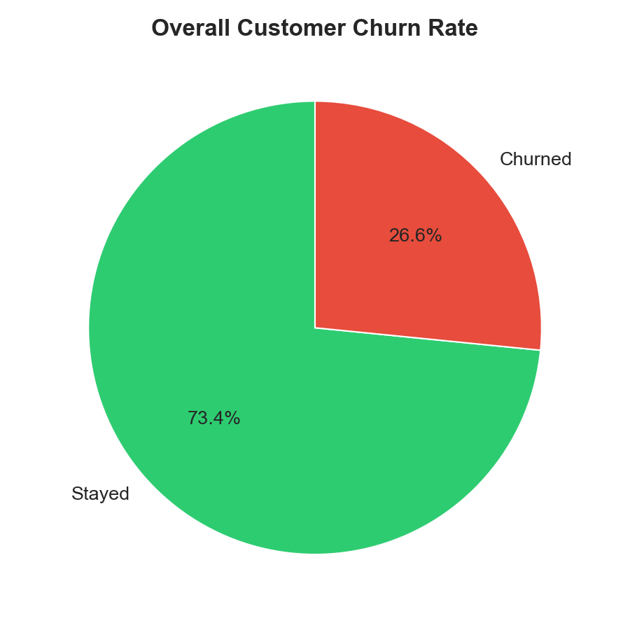
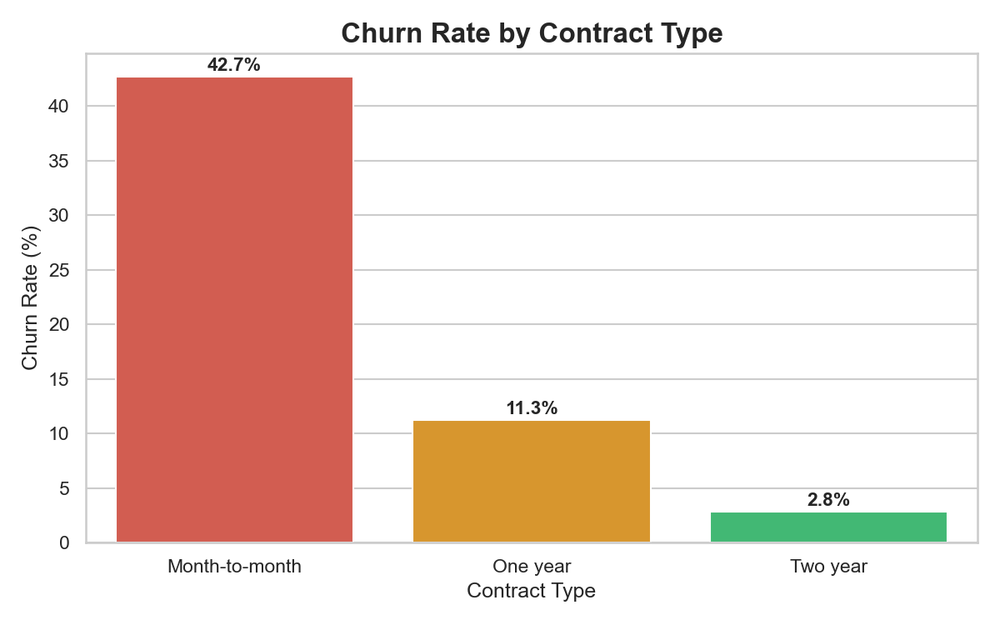
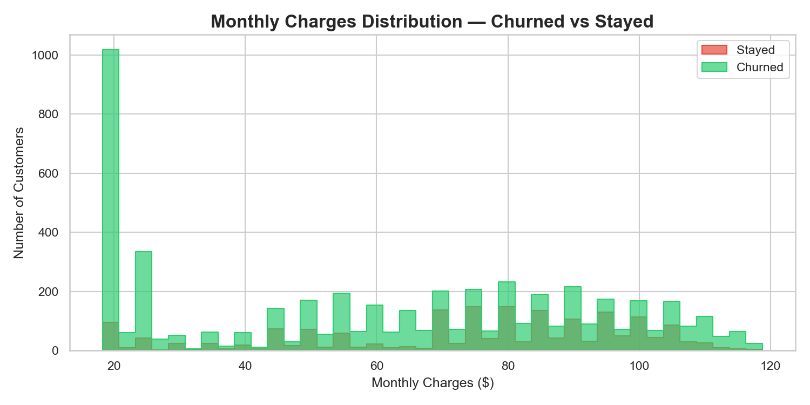
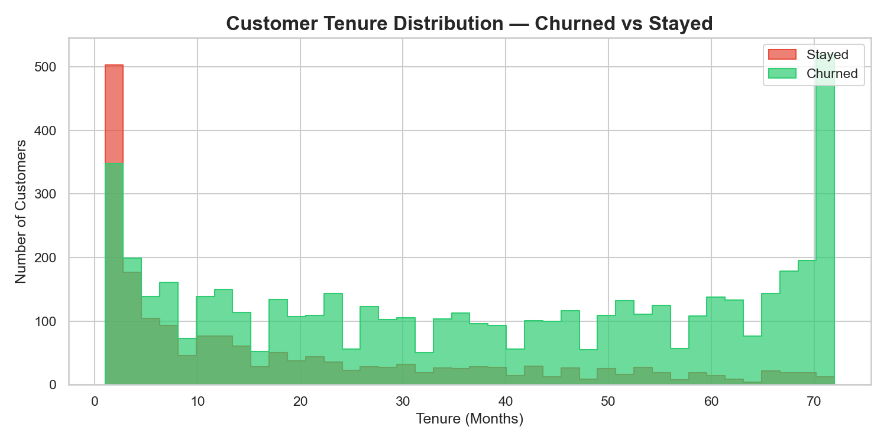
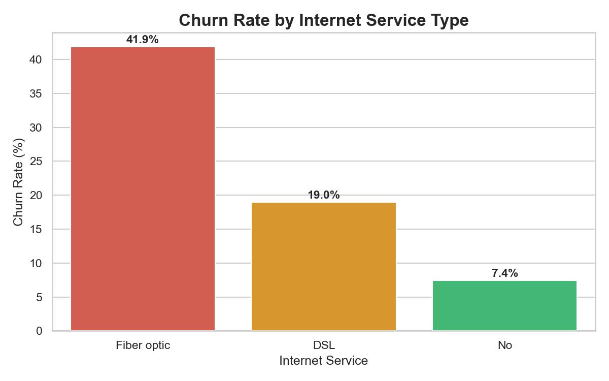
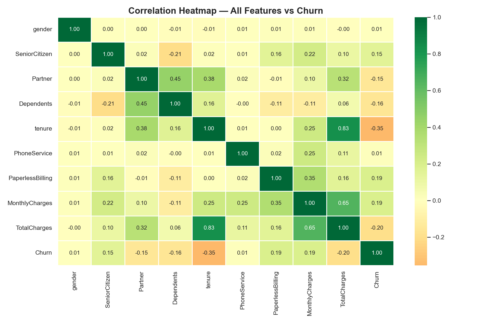

# 📊 Customer Churn Analysis — Telco Company
   

## 🎯 Project Overview
A telecom company is losing customers and wants to understand **who is leaving, why they are leaving, and which customers are at highest risk.** This project performs end-to-end data analysis using Python and SQL to identify churn drivers and provide actionable business recommendations.

> **Business Problem:** 1 in 4 customers is churning — costing the company millions in lost revenue. Which customers are most at risk and why?

---

## 📁 Project Structure
```
Customer_Churn_Project/
│
├── Customer_Churn_Analysis.ipynb   # Main analysis notebook
├── sql_analysis_results.xlsx       # SQL query results (5 sheets)
├── WA_Fn-UseC_-Telco-Customer-Churn.csv  # Raw dataset
│
├── charts/
│   ├── chart1_churn_rate.png
│   ├── chart2_contract_churn.png
│   ├── chart3_monthly_charges.png
│   ├── chart4_tenure.png
│   ├── chart5_internet_service.png
│   └── chart6_heatmap.png
│
└── README.md
```

---

## 🛠️ Tools & Technologies
| Tool | Purpose |
|------|---------|
| Python 3 | Core programming language |
| Pandas | Data cleaning & manipulation |
| Seaborn & Matplotlib | Data visualization |
| SQLite (via Python) | SQL-based business analysis |
| Jupyter Notebook | Development environment |

---

## 📦 Dataset
- **Source:** [Telco Customer Churn — Kaggle](https://www.kaggle.com/datasets/blastchar/telco-customer-churn)
- **Size:** 7,032 customers | 20 features
- **Features include:** Contract type, tenure, monthly charges, internet service, payment method, and more

---

## 🔄 Project Workflow

```
Phase 1: Data Loading & Exploration
         ↓
Phase 2: Data Cleaning
         (Fixed TotalCharges dtype, removed 11 null rows, encoded target)
         ↓
Phase 3: Exploratory Data Analysis (EDA)
         (6 business questions answered with visualizations)
         ↓
Phase 4: SQL Analysis
         (5 SQL queries using SQLite — churn by segment, tenure buckets, high-risk identification)
         ↓
Phase 5: Business Insights & Recommendations
```

---

## 🔍 Key Findings

### Finding 1 — Overall Churn Rate
- **26.58%** of customers churned (1,869 out of 7,032)
- 1 in 4 customers is leaving the company

### Finding 2 — Contract Type is the #1 Churn Driver
| Contract | Churn Rate |
|----------|-----------|
| Month-to-month | 42.71% |
| One year | 11.28% |
| Two year | 2.85% |

→ Customers on month-to-month contracts churn **15x more** than two-year contract customers

### Finding 3 — Fiber Optic Customers at High Risk
| Internet Service | Churn Rate |
|-----------------|-----------|
| Fiber optic | 41.89% |
| DSL | 19.00% |
| No internet | 7.43% |

→ Possible service quality or pricing dissatisfaction among Fiber optic users

### Finding 4 — New Customers are Most Vulnerable
| Tenure Group | Churn Rate |
|-------------|-----------|
| 0–12 months (New) | 47.68% |
| 13–24 months | 28.71% |
| 25–48 months | 20.39% |
| 49+ months (Loyal) | 9.51% |

→ The **first year is critical** — nearly half of new customers leave

### Finding 5 — Highest Risk Segment Identified (SQL)
- **Month-to-month + Fiber optic + Paperless billing = 56.96% churn rate**
- This segment has 1,689 customers — the top priority for retention campaigns

---

## 💡 Business Recommendations

| # | Recommendation | Target |
|---|---------------|--------|
| 1 | Offer discounts to move customers to yearly contracts | Month-to-month customers |
| 2 | Create a 90-day onboarding & engagement program | New customers (0–12 months) |
| 3 | Investigate Fiber optic service quality and pricing | Fiber optic subscribers |
| 4 | Launch retention campaign targeting high-risk segment | 1,689 high-risk customers |

---

## 📊 Visualizations

| Chart | Insight |
|-------|---------|
|  | 26.6% overall churn rate |
|  | Month-to-month = 42.7% churn |
|  | Higher charges = higher churn |
|  | New customers churn the most |
|  | Fiber optic = highest risk |
|  | Tenure has strongest negative correlation with churn |

---

## ▶️ How to Run This Project

1. Clone this repository
```bash
git clone https://github.com/YOUR_USERNAME/customer-churn-analysis.git
cd customer-churn-analysis
```

2. Install required libraries
```bash
pip install pandas numpy matplotlib seaborn openpyxl
```

3. Open the notebook
```bash
jupyter notebook Customer_Churn_Analysis.ipynb
```

4. Run all cells from top to bottom

---

## 👤 Author
**Devendra**
- 📧 [Your Email]
- 💼 [Your LinkedIn URL]
- 🐙 [Your GitHub URL]

---

## 📌 Resume Line for This Project
> *"Analyzed Telco churn dataset of 7,032 customers using Python & SQL — identified Month-to-month + Fiber optic segment with 56.96% churn rate and recommended 4 targeted retention strategies"*
